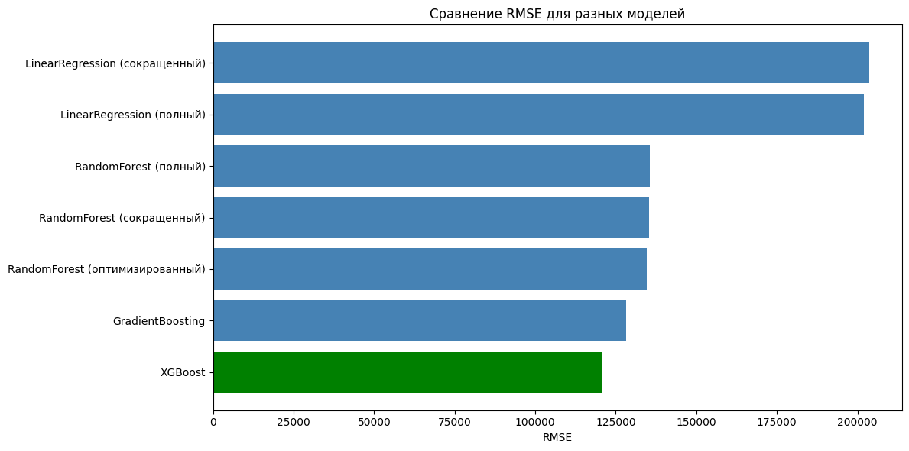

Вот готовый отчет с **реальными цифрами** из вашего ноутбука:

---

# Лабораторная работа №5

**Тема:** Предсказание цен на недвижимость с применением Scikit-Learn

---

## [**Гугл коллаб**](https://colab.research.google.com/drive/1cZFl4F55UnJZMN-5FeEn2D4959xPoB6_?usp=sharing)

---

## Цель работы

Освоить методы регрессионного анализа с использованием библиотеки Scikit-Learn. Научиться оценивать качество моделей с помощью метрик MAE, MSE, RMSE. Исследовать альтернативные алгоритмы (Gradient Boosting, XGBoost). Провести оптимизацию гиперпараметров Random Forest. Изучить способ интеграции обученной модели в веб-сервис.

---

## Ход работы

1. Загружены данные по ценам на недвижимость в округе Кинг — 21613 наблюдений, 21 переменная.
2. Данные разделены на обучающую (15129 строк, 16 признаков) и тестовую (6484 строк) выборки.
3. Выполнена предобработка: пропусков нет, все признаки числовые (int64, float64).
4. Обучены базовые модели:
   - Linear Regression
   - Random Forest (n_estimators=10)
5. Рассчитаны метрики MAE и RMSE, построены scatter-графики "Реальная vs Предсказанная цена".
6. Выполнен анализ важности признаков.

**Результаты базовых моделей:**

| Модель | MAE | RMSE |
|--------|-----|------|
| Linear Regression | 126852.51 | 201883.24 |
| Random Forest (базовый) | 75039.37 | 141105.01 |

Random Forest визуально и метрически превзошел линейную регрессию.

---

## Самостоятельная работа

### 1. Исключение незначащих признаков

Определены 5 наименее важных признаков (по feature_importances_):

| Признак | Важность |
|---------|----------|
| Площадь подвала | 0.007123 |
| Состояние | 0.003868 |
| Спальни | 0.003849 |
| Количество этажей | 0.002792 |
| Год реновации | 0.002428 |

**Сравнение RMSE до и после удаления:**

| Модель | RMSE (полный) | RMSE (сокращенный) | Изменение |
|--------|---------------|---------------------|-----------|
| Linear Regression | 201883.24 | 203678.30 | +1795.06 (+0.89%) |
| Random Forest | 135516.61 | 135282.18 | -234.44 (-0.17%) |

**Вывод:** удаление незначащих признаков незначительно повлияло на качество. Linear Regression немного ухудшился, Random Forest — немного улучшился.

### 2. Оптимизация Random Forest

После подбора параметров (n_estimators=300, max_depth=20, min_samples_split=5, min_samples_leaf=2, max_features='sqrt'):

| Модель | RMSE |
|--------|------|
| Random Forest (сокращенный) | 135282.18 |
| Random Forest (оптимизированный) | 134611.38 |

Улучшение RMSE составило 670.80.

### 3. Исследование других моделей

Обучены GradientBoostingRegressor и XGBoost.

**Сводная таблица результатов:**

| Модель | RMSE |
|--------|------|
| XGBoost | 120573.91 |
| GradientBoosting | 128183.01 |
| RandomForest (оптимизированный) | 134611.38 |
| RandomForest (сокращенный) | 135282.18 |
| RandomForest (полный) | 135516.61 |
| LinearRegression (полный) | 201883.24 |
| LinearRegression (сокращенный) | 203678.30 |

**Визуализация:** построен bar chart сравнения RMSE всех моделей.


**Вывод:** XGBoost показал наилучший результат (RMSE = 120573.91). GradientBoosting занял второе место (RMSE = 128183.01). Линейная регрессия ожидаемо показала наихудший результат.

### 4. Интеграция модели в веб-сервис — пошаговый алгоритм (FastAPI)

1. **Сохранить модель:**
   ```python
   import joblib
   joblib.dump(xgb_model, 'model.pkl')
   ```

2. **Создать FastAPI-приложение** (`main.py`), загрузить модель.

3. **Описать Pydantic-схему** для признаков недвижимости.

4. **Создать POST `/predict`:** принять JSON, преобразовать в DataFrame, вызвать `model.predict()`, вернуть цену.

5. **Упаковать в Docker**, развернуть на сервере.

---

## Выводы

1. Освоены методы регрессии в Scikit-Learn, метрики MAE, MSE, RMSE.
2. **XGBoost показал наилучший результат** (RMSE = 120573.91), улучшив базовый Random Forest на ~14942.
3. **GradientBoosting** занял второе место (RMSE = 128183.01).
4. **Оптимизация Random Forest** дала небольшое улучшение (~670 RMSE).
5. **Удаление незначащих признаков** практически не повлияло на качество моделей, но сократило количество признаков с 15 до 10.
6. Линейная регрессия показала наихудший результат, так как неспособна улавливать нелинейные зависимости.
7. Изучен способ интеграции обученной модели в веб-сервис через FastAPI.